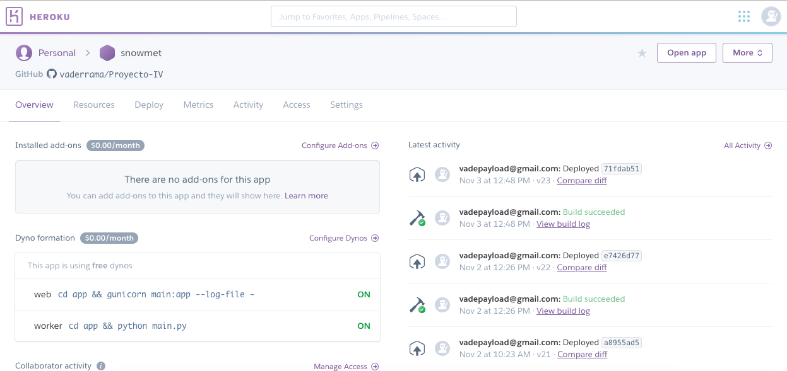
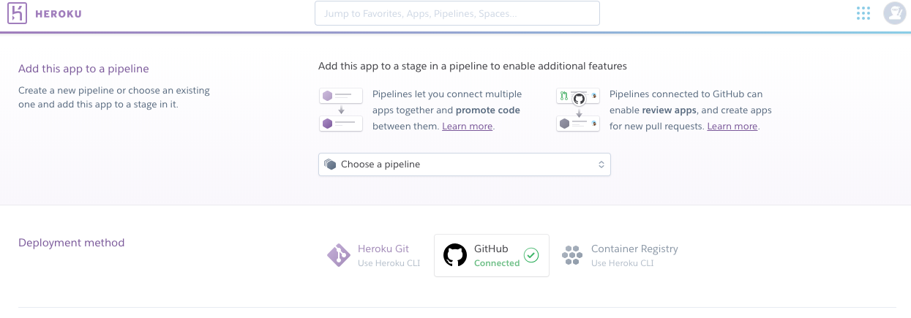
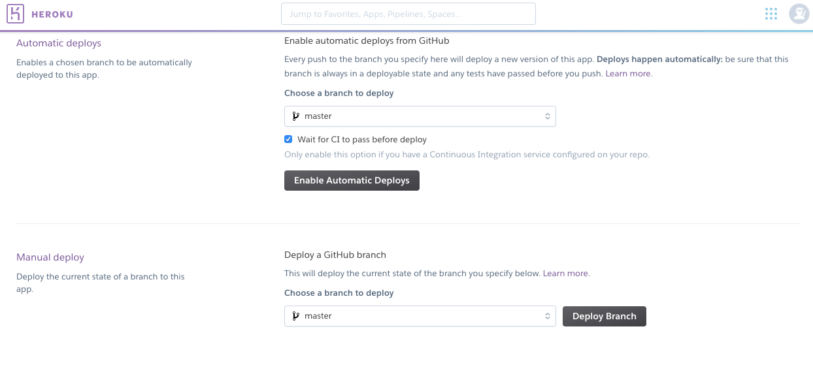

# Despliegue Microservicio Heroku  

## Despliegue con Heroku

Hemos utilizado el sistema Heroku por su versatilidad a la hora de desplegar aplicaciones web de pequeña capacidad , así como su perfecta integración con GitHub y Travis-CI , lo que lo hace un servicio PaaS muy recomendando.

Para su correcto funcionamiento , dispondremos de un archivo en nuestro repositorio , llamado **Procfile**

- ### Procfile

 [Procfile](https://github.com/vaderrama/Proyecto-IV/blob/master/Procfile)

En nuestro procfile disponemos de dos lineas :
- En la primera linea se indica al procfile donde se encuentra nuestro archivo principal y como ejecutarlo , utilizamos el proceso **"web"**. Además del log
- La segunda linea no la esta activada actualmente , ya que no la necesitamos por ahora.  ( "worker" )
Para ello , necesitamos registrarnos en la web : [Heroku](https://www.heroku.com/)

Una vez registrados , podemos crear una aplicación ( directorio ) , donde su pagina principal seria algo asi 

***en esta imagen se puede observar la pagina principal de un proyecto una vez que hayamos terminado todos los pasos que hemos seguido***

Una vez creada la aplicación , tenemos varias opciones para poder desplegar nuestro proyecto. Una de ellas y la que he realizado en SnowMet , es enlazar esta app con GitHub de la siguiente manera : 

Cuando ya hemos enlazado nuestro proyecto con GitHub , podemos lanzarlo de manera local utilizando "Heroku local" para probar su correcto funcionamiento.

Activamos el boton "Wait to CI to pass before deploy" para realizar los test automaticamente y con cada push ( con Travis-CI en este caso ) antes de desplegar nuestra app. 

Una vez probado su correcto funcionamiento en local , para poder desplegarlo debemos hacer click en el boton **Deploy Branch**

Cuando hemos realizado estos pasos , podremos observar nuestra app en las siguientes direcciones : 

Despliegue : https://snowmet.herokuapp.com/ 

