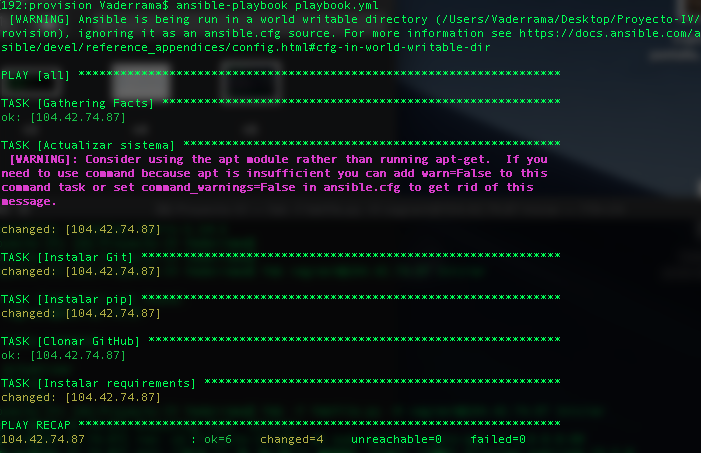
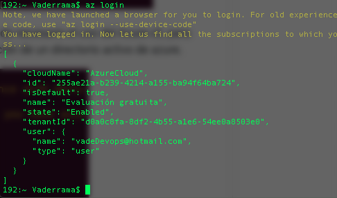
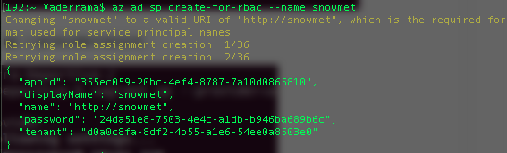
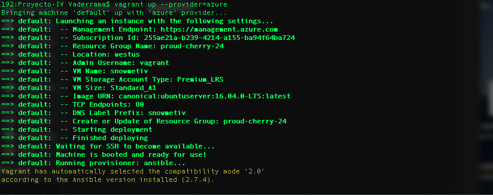
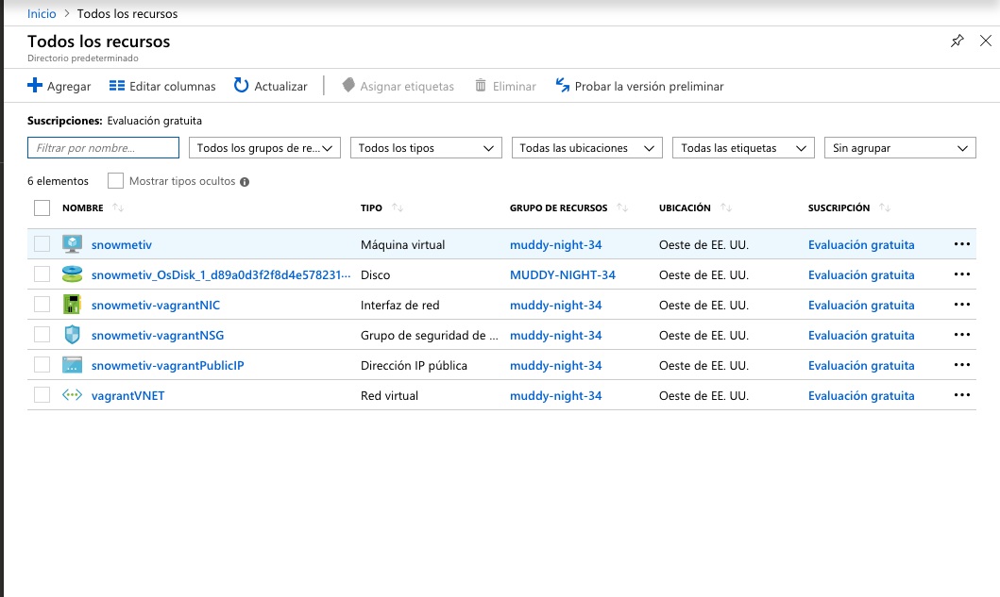

# Despliegue desde 0 de un microservicio en la nube

Vamos a dividir en 3 partes el despliegue de este microservicio desde 0 en la nube :

- 1.Provisionamiento
- 2.Creación maquinas virtuales
- 3.Despliegue

## Provisionamiento

En esta parte , hemos utilizado el software Ansible para poder satisfacer todos los requisitos necesarios para que nuestro microservicio funcione correctamente en la maquina virtual que desplegaremos en el siguiente punto. 

Primero instalamos Ansible y modificamos el archivo de hosts , en mi caso creado en el mismo directorio del microservicio ( Proyecto-IV/provision/hosts ).

El archivo hosts : 

    - [snowmetiv]
    - 104.42.74.87 ansible_ssh_user=vagrant

He puesto "ansible_ssh_user=vagrant" para forzar a utilizar el usuario "vagrant" para el acceso a nuestra maquina virtual en azure. 

El archivo que vamos a ejecutar desde Ansible es **playbook.yml**, lo ejecutaremos mediante el comando ***ansible-playbook playbook.yml*** el cual posteriormente incluiremos en el Vagrantfile.

Archivo playbook.yml : [Playbook.yml](https://github.com/vaderrama/Proyecto-IV/blob/master/provision/playbook.yml)

Ejecución de Ansible-playbook playbook.yml : 

## Creación maquinas virtuales

En este punto , he utilizado Vagrant para la orquestación en la creación de las maquinas virtuales , ademas de Azure para el despliegue en la nube de las mismas. 

Para ello , es necesario crear un archivo llamado Vagrantfile.
Archivo  Vagranfile : [Vagrantfile](https://github.com/vaderrama/Proyecto-IV/blob/masterVagrantfile)

En este archivo se han utilizado unas reglas específicas para el uso y despliegue de una máquina virtual con Vagrant y Azure. 
Ademas , se necesita exportar las variables de entorno que podemos observar en el archivo , como son : **TenantID , ClientID, ClientSecret , SubscriptionID**

Para su obteción hemos necesitado hacer "login" en Azure desde nuestro terminal , asi como crear un directorio activo de azure.  
    
    - az login
    - az ad sp create-for-rbac --name snowmetiv
    
Lo que nos devuelve 

Tambien disponemos de 3 lineas donde podemos configurar caracteristicas de la maquina virtual , como su nombre , tamaño o puerto : 

    azure.vm_name = 'snowmetiv'
    azure.vm_size = 'Standard_A1'
    azure.tcp_endpoints = '80'

Al final del archivo se puede ver la ejecución del script creado anteriormente para el provisionamiento. 

    - config.vm.provision :ansible do |ansible|
        ansible.playbook = "provision/playbook.yml"
    end
    
    
    

Una vez hemos exportado las variables de entorno y hemos configurado correctamente vagrant y ansible , procedemos a hacer ; 

    vagrant up --provider=azure
    

Una vez terminada la ejecución del comando anterior , podemos ir a Azure para ver como se han creado todos los recursos necesarios automaticamente 

## Despliegue

En el despliegue he utilizado Fabric , un software para poder llevar a acabo ordenes de manera automática a traves de ssh.

Para su instalación hemos utilizado esta orden :

    - pip install "fabric<2"

Ya que otras versiones no funcionan correctamente con nuestras necesidades.

Para ello necesitamos crear un archivo ***fabfile.py***

Archivo fabfile.py : [Fabfile.py](https://github.com/vaderrama/Proyecto-IV/blob/master/despliegue/fabfile.py)

Este archivo consta de diferentes funciones que utilizamos para ejecutar en nuestra maquina , como por ejemplo Iniciar el servicio. 

La orden que necesitamos utilizar para realizar alguna de las funciones de despliegue , por por ejemplo iniciar el servicio seria :

    - fab -f fabfile.py -H vagrant@104.42.74.87 Iniciar
    

La dirección donde podemos acceder a la maquina : 

    - http://snowmetiv.westus.cloudapp.azure.com
   

